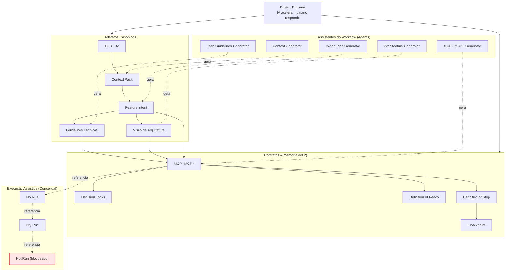

# 🗺️ Mapa Visual — AI-Assisted SDLC Workflow (Governado)

<!-- MAPA VISUAL -->
<!-- DIDÁTICO | NÃO NORMATIVO -->
<!-- EXPLICITA ARTEFATOS, ASSISTENTES E GOVERNANÇA -->

Este mapa visual apresenta a **estrutura completa e governada** do
**AI-Assisted SDLC Workflow**, explicitando:

- artefatos canônicos
- assistentes (agents) como geradores
- contratos e memória como eixo central
- execução como conceito bloqueado

⚠️ Este diagrama **não representa pipeline técnico**
nem autoriza execução automática.

---

## 🧭 Como ler este mapa

- **Centro:** contratos e decisões humanas
- **Esquerda:** artefatos principais do método
- **Direita:** assistentes (agents) que geram artefatos
- **Abaixo:** execução apenas conceitual
- **Acima:** diretriz primária (autoridade máxima)

---

## 🧩 Mapa Conceitual (Artefatos × Assistentes × Governança)


```
Diretriz Primária
  |
  +--> Artefatos Canônicos: PRD-Lite -> Context Pack -> Feature Intent
  |                         Feature Intent -> Guidelines / Arquitetura
  |                         (todos alimentam MCP/MCP+)
  |
  +--> Contratos & Memória (v0.2): MCP/MCP+ -> Decision Locks -> DoR/DoS -> Checkpoint
  |
  +--> Assistentes (Agents) geram artefatos:
        - Context Generator ---------> Context Pack
        - Tech Guidelines Generator -> Guidelines
        - Architecture Generator ----> Arquitetura
        - Action Plan Generator -----> Feature Intent (ou Action Plan, se existir)
        - MCP/MCP+ Generator --------> MCP/MCP+

Execução (v0.3): No Run -> Dry Run -> Hot Run (BLOQUEADO)
```

